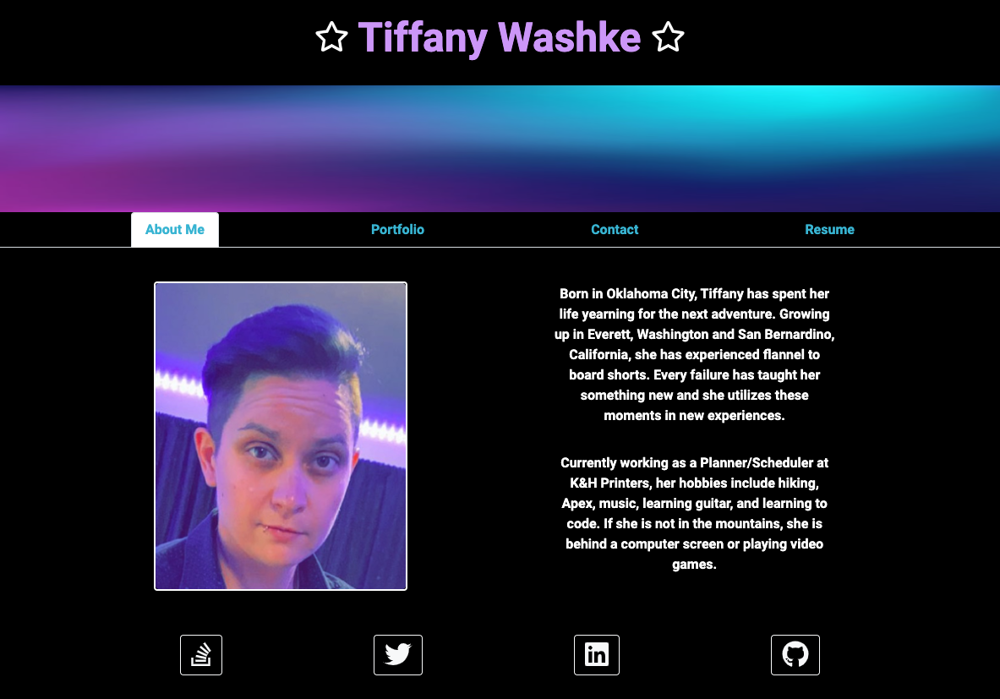
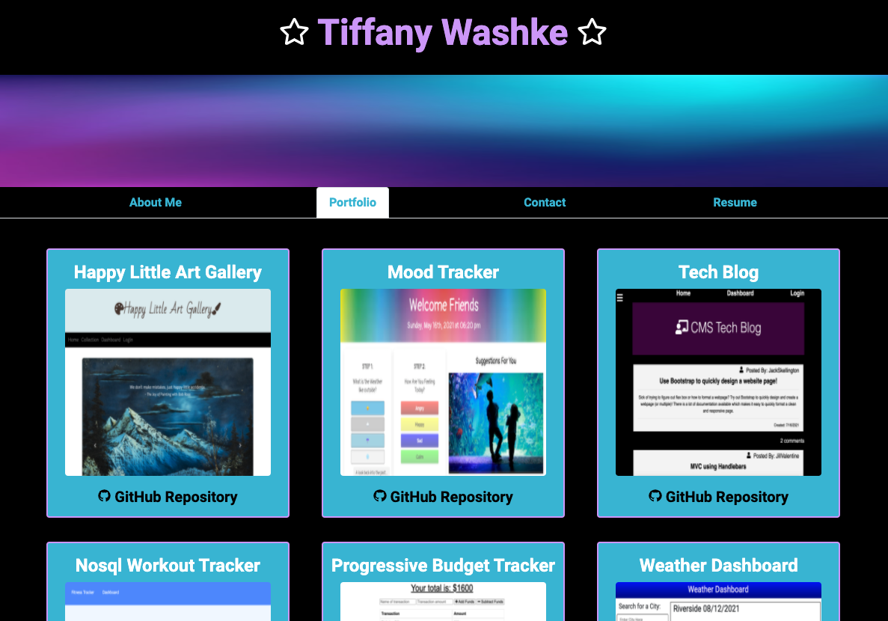
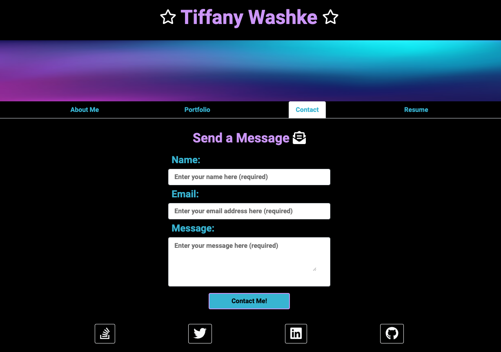
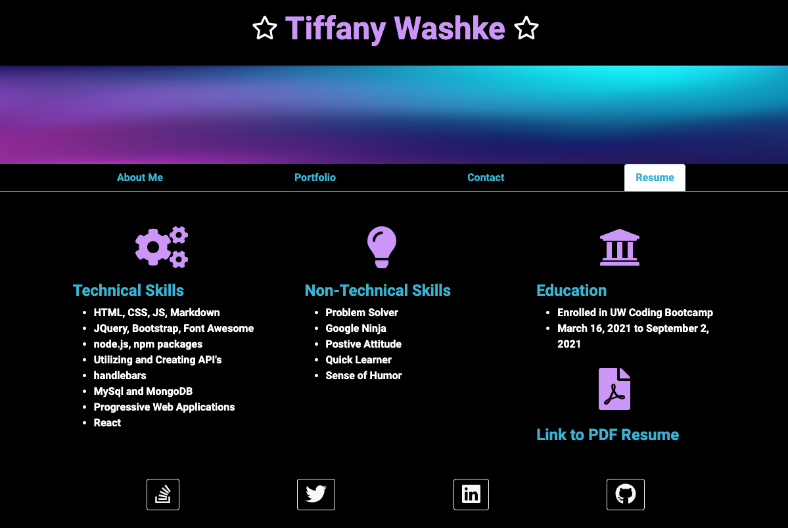
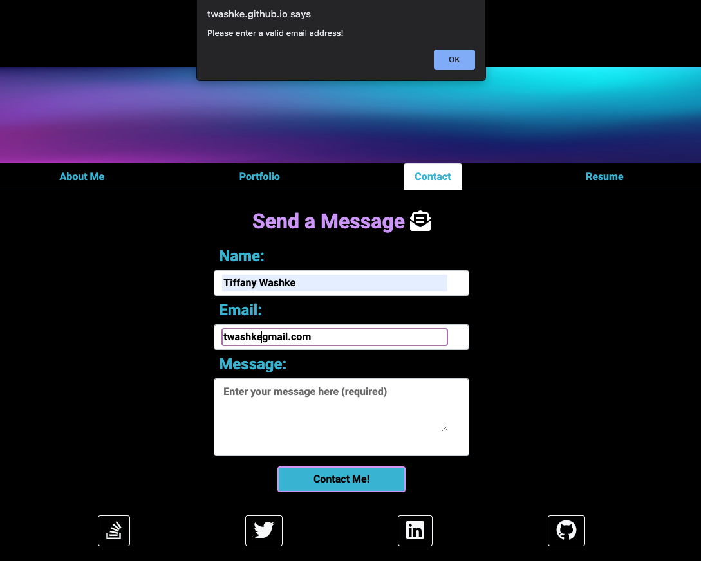
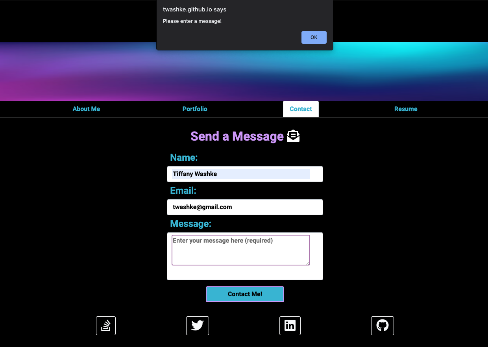
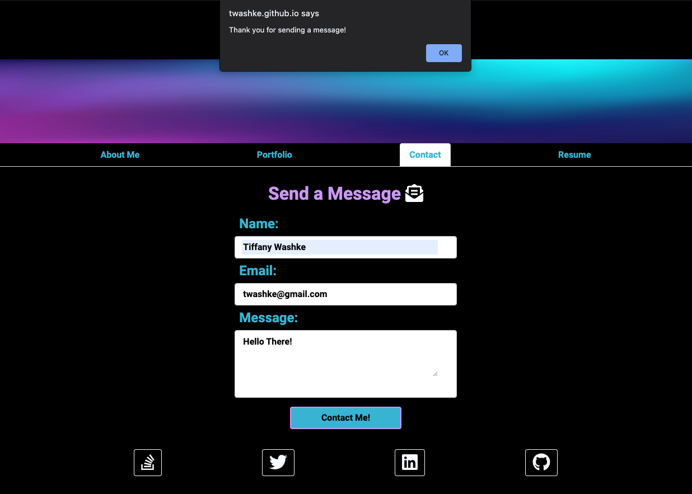
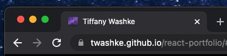

# Tiffany Washke React Portfolio

 

## Description

A portfolio for Tiffany Washke utilizing [React](https://reactjs.org/) and designed to be mobile friendly. When initally opened the page loads the **About Me** page where a profile picture and biography is displayed. The **Nav Tabs** of the section being viewed is highlighted to show which page is active. The **Navigation Tabs** shows the user the following options: [About Me](https://twashke.github.io/react-portfolio/#about), [Portfolio](https://twashke.github.io/react-portfolio/#portfolio), [Contact](https://twashke.github.io/react-portfolio/#contact), and [Resume](https://twashke.github.io/react-portfolio/#resume). Each page includes a header with the name and a banner, while the footer includes links to **Tiffany Washke's** [Stack Overflow](https://stackoverflow.com/), [Twitter](https://twitter.com/?lang=en), [LinkedIn](https://www.linkedin.com/), and [GitHub](https://github.com/).

## Table of Contents

- [About the Project](#about-the-project)
- [Installation](#installation)
- [Usage](#usage)
- [Contributing](#contributing)
- [Tests](#tests)
- [License](#license)
- [Questions](#questions)

## About the Project

- This application was designed to be mobile friendly and was designed utilizing [React](https://reactjs.org/).
- The application opens to the [**About Me**](https://twashke.github.io/react-portfolio/#about) section where a picture and a biography for Tiffany Washke is displayed.
- The navigation tabs allow the user to navigate between the different pages and the current page the user is on remains highlighted.
- The [**Portfolio**](https://twashke.github.io/react-portfolio/#portfolio) section allows the user the ability to view Tiffany Washke's projects. The projects include a link to the website (either the picture or project name), as well as a link to the GitHub Repository.
- The [**Contact**](https://twashke.github.io/react-portfolio/#contact) section allows the user to input their name, email and message. Since this is only a client side portfolio, this information is not stored anywhere.
- The user inputs are validated, if the user leaves a field empty after clicking on it, an alert will pop up letting the user know what to fix. If the email is not an email address, the user will also be notified to input a valid email address. Once all fields are filled and the button is pushed, an alert thanks the user and the message can be seen in the console (in the future this could be a post request to send an email; however, no server is currently being utilized for this project). Once the message has been sent, the user is redirected to the **About Me** section.
- The [**Resume**](https://twashke.github.io/react-portfolio/#resume) section includes techincal skills, non-technical skills, and education. A PDF link to the resume is also included (click on the PDF icon or the Link to Resune PDF).
- The React image was replaced with a new Favicon image generated using [Favicon Generator](https://favicon.io/) and the [Milky Way emoji 🌌](https://emojipedia.org/emoji/%F0%9F%8C%8C/).

- Built with the following technologies:
  - [create-react-app](https://www.npmjs.com/package/create-react-app)
  - [bootstrap](https://www.npmjs.com/package/bootstrap)
  - [Font Awesome Regular Icons](https://www.npmjs.com/package/@fortawesome/free-brands-svg-icons)
  - [Font Awesome Brand Icons](https://www.npmjs.com/package/@fortawesome/free-regular-svg-icons)
  - [Font Awesome Solid Icons](https://www.npmjs.com/package/@fortawesome/free-solid-svg-icons)
  - [gh-pages](https://www.npmjs.com/package/gh-pages)
  - [Favicon Generator](https://favicon.io/)
  - [HTML](https://www.w3schools.com/html/), [CSS](https://www.w3.org/Style/CSS/Overview.en.html), and [Javascript](https://www.javascript.com/)

## Installation

- Open [react portfolio GitHub Repository](https://github.com/twashke/react-portfolio).
- Use the command line to **git clone**
- **npm install**
- **npm start** from command line to connect server.
- Go to [localhost:3000](http://localhost:3000/) in Web Browser to view.

## Usage

- Go to [Deployed React Portfolio](https://twashke.github.io/react-portfolio/).
- Use the Navigation Tabs to view the following sections: **About Me**, **Portfolio**, **Contact**, and **Resume**.
- On the **Portfolio** page, check out projects I have created or have been a part of.
- Send a message on the **Contact** page and view the console to see the user input (future updates would include the addition of a server to make requests using the user input).
- The **Resume** section includes a link to a PDF Resune.

\
Mobile Friendly Design \
\

\

**About Me** Section \
\

**Portfolio** Section \
\

**Contact** Section \
\

**Resume** Section \
\

Error for Invalid Email Address \
\

Error for No Message Entered \
\

Thank you Alert After User Input \
\

Favicon Image Updated \
\

## Contributing

- Used code from previous versions of the [Tiffany Washke Portfolio](https://twashke.github.io/Tiffany-Washke-Portfolio-Update/)

## Tests

- Tested form validation (both when cursor leaves field and verifying an email address is used).

## License

This application is covered by the [MIT License](https://opensource.org/licenses/MIT).

      Copyright 2021 Tiffany Washke

      Permission is hereby granted, free of charge, to any person obtaining a copy of this software and associated documentation files (the "Software"), to deal in the Software without restriction, including without limitation the rights to use, copy, modify, merge, publish, distribute, sublicense, and/or sell copies of the Software, and to permit persons to whom the Software is furnished to do so, subject to the following conditions:

      The above copyright notice and this permission notice shall be included in all copies or substantial portions of the Software.

      THE SOFTWARE IS PROVIDED "AS IS", WITHOUT WARRANTY OF ANY KIND, EXPRESS OR IMPLIED, INCLUDING BUT NOT LIMITED TO THE WARRANTIES OF MERCHANTABILITY, FITNESS FOR A PARTICULAR PURPOSE AND NONINFRINGEMENT. IN NO EVENT SHALL THE AUTHORS OR COPYRIGHT HOLDERS BE LIABLE FOR ANY CLAIM, DAMAGES OR OTHER LIABILITY, WHETHER IN AN ACTION OF CONTRACT, TORT OR OTHERWISE, ARISING FROM, OUT OF OR IN CONNECTION WITH THE SOFTWARE OR THE USE OR OTHER DEALINGS IN THE SOFTWARE.

## Questions

**Contact Tiffany Washke**

- **Email directly at** twashke@gmail.com
- **GitHub User Name:** [twashke](https://github.com/twashke)

